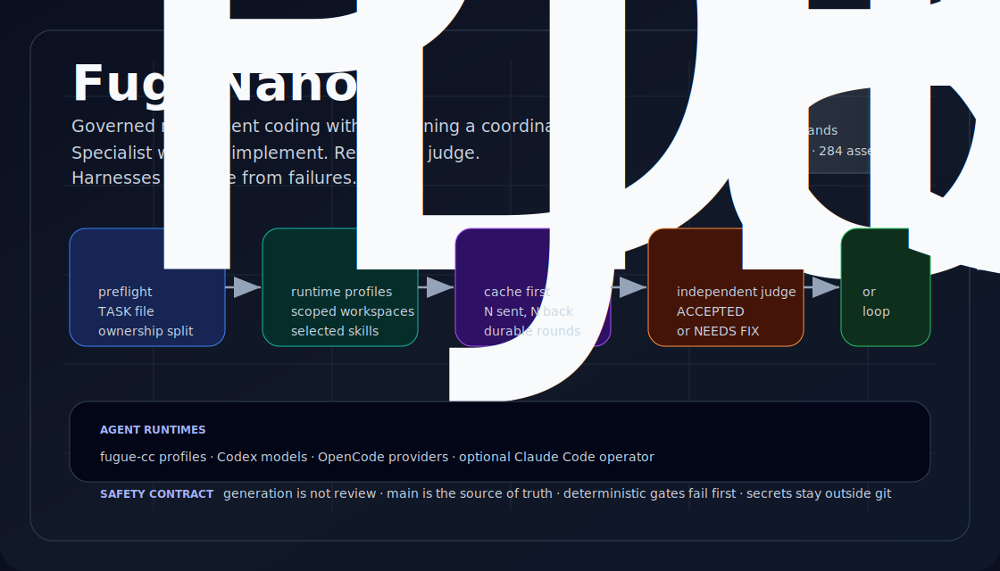
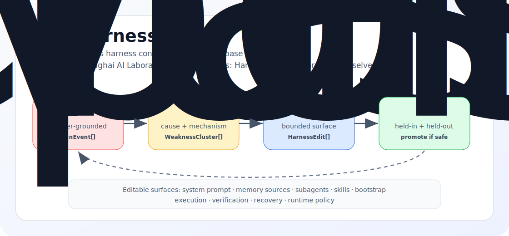

<div align="center">

[](README.md) &nbsp; [](README.zh-CN.md)

# FuguNano

### Open & light-weight version reimplementation of Sakana Fugu.

<p align="center">
  = 18.18" />
  
  
  
  <a href="https://github.com/BicaMindLabs/FuguNano/actions/workflows/ci.yml"></a>
  
</p>

<p align="center">
  <a href="#quick-start">Quick Start</a> ·
  <a href="docs/AGENT_RUNTIME.md">Agent Runtime</a> ·
  <a href="docs/WORKFLOW.md">Workflow</a> ·
  <a href="docs/SELF_HARNESS.md">Self-Harness</a> ·
  <a href="docs/PARITY.md">Engine Parity</a> ·
  <a href="NOTICE">Attribution</a>
</p>

<p align="center">
  
</p>

</div>

> A repo-native, multi-agent coding loop powered by 9+ LLMs (isolated via
> Claude Code) and an independent Codex reviewer. Lightweight, bounded, and
> self-improving (Self-Harness) - no coordinator training required.
> It is intentionally provider-neutral: use the accessible models you trust
> today, add more runtimes tomorrow, and keep the engineering loop the same.

## Highlights

- **One operator surface** - `fuguectl` drives preflight, dispatch, cache,
  integration, review, loop state, routing, skills, and runtime maintenance.
- **Runtime-neutral agents** - logical agent profiles route work to Claude Code
  provider instances, Codex models, OpenCode providers, or future harnesses
  without changing the loop.
- **Extensible model pool** - current profiles are just starting points.
  Community adapters can add accessible commercial, open, private, local, or
  self-hosted models without changing FuguNano's core contract.
- **Real isolation** - workers edit separate worktrees with scoped workspaces,
  selected skills, and optional ownership enforcement.
- **Review stays independent** - implementers write, while Codex or another
  configured independent reviewer returns `ACCEPTED` or `NEEDS FIX`.
- **No lost outputs** - dispatch can persist reviewer/agent output with `--out`,
  and the join barrier still enforces N sent, N returned.
- **Bounded repair** - keep-best, confirmation passes, user escalation, and
  non-convergence states keep the loop from spinning forever.
- **Learning without training** - allocation blends benchmark priors with live
  review outcomes, while completed and relabeled failed TASK traces become
  cause-aware experience memory selected by the next task or prompt.
- **Self-Harness ready** - the TypeScript engine can mine failed runs, propose
  bounded harness edits, and promote only non-regressing changes.

## Quick Start

Requirements: macOS or Linux, Node.js >= 18.18, `git`, `tmux`, and the model/API
credentials you choose to use. Codex is recommended for review.

```bash
git clone https://github.com/BicaMindLabs/FuguNano fugunano
cd fugunano

/path/to/fugunano/orchestration/fuguectl/fuguectl help quickstart
/path/to/fugunano/orchestration/fuguectl/fuguectl init --dry-run
make doctor       # inspect local CLIs and provider readiness
make install      # install model launchers
make verify       # verify launcher wiring
make ci-clean     # run the full local gate from a clean engine install
```

Real keys stay outside the repository:

```bash
mkdir -p ~/.config
$EDITOR ~/.config/cc-model-secrets.env
```

Choose the runtimes you want to use. The TypeScript engine now models agents as
profiles: a logical id, a harness (`fugue-cc`, `codex`, `opencode`), an optional
harness-native target, and a model family used by policy. See
[docs/AGENT_RUNTIME.md](docs/AGENT_RUNTIME.md).

For the optional `fugue-cc` worktree fleet, add a provider config to the project
you want the fleet to edit:

```bash
cp orchestration/fugue-cc/provider.config.example /path/to/project/.fugue-cc/provider.config
cd /path/to/project
fugue-cc
```

Then run the operator from another shell:

```bash
/path/to/fugunano/orchestration/fuguectl/fuguectl preflight --harness fugue-cc
/path/to/fugunano/orchestration/fuguectl/fuguectl fleet status
```

## Operator Skill

```bash
make install-skill
```

This installs `/fugunano` to `~/.claude/skills/fugunano` as a convenience operator
entry for Claude Code. The workflow itself is not Claude Code-specific: Codex,
OpenCode, Antigravity, and other agents can follow [AGENTS.md](AGENTS.md) and
dispatch through the same agent profiles. Smoke-test the installed bundle:

```bash
~/.claude/skills/fugunano/fuguectl selftest
```

## How The Loop Works

```bash
fuguectl preflight --harness codex        # lite reviewer path
fuguectl preflight --harness opencode --target opencode/deepseek-v4-flash-free
fuguectl preflight --harness agy
fuguectl preflight --harness lite         # all lite runtimes: codex + opencode + agy
fuguectl preflight --harness fugue-cc     # full worktree fleet path
fuguectl task new "implement feature"
fuguectl plan "implement feature" --harness lite --codex-clean --allow-partial --out /tmp/fugunano-plan --task TASK.md
fuguectl dispatch cc-deepseek --template impl --task TASK.md --task-type backend
fuguectl cache barrier <round>
fuguectl integrate --work /path/to/project --agents "cc-deepseek cc-kimi"
fuguectl loop record --verdict NEEDS_FIX --round 1
fuguectl loop decide
```

| Phase     | What FuguNano does                                                                      |
| --------- | --------------------------------------------------------------------------------------- |
| Plan      | Run preflight, create a TASK file, split ownership, and pick workers.                   |
| Dispatch  | Send scoped prompts through `fuguectl dispatch`.                                        |
| Gather    | Cache every terminal result and wait at the join barrier.                               |
| Integrate | Cherry-pick reviewed worktrees onto `main`; isolate conflicts and ownership violations. |
| Review    | Ask an independent reviewer for an `ACCEPTED` / `NEEDS FIX` verdict.                    |
| Repair    | Use the bounded loop state machine until accepted or escalated.                         |

Read the full walkthrough in [docs/WORKFLOW.md](docs/WORKFLOW.md).

## Fugu, OpenFugu, And FuguNano

Sakana Fugu, OpenFugu, and FuguNano share the same direction: when a
single frontier model or hardware path is expensive, unavailable, or hard to
govern, coordination becomes the system capability. The difference is where
that coordination layer lives.

<p align="center">
  
</p>

| System      | Coordination layer              | What it opens                                                                 | Adoption shape                                                           |
| ----------- | ------------------------------- | ----------------------------------------------------------------------------- | ------------------------------------------------------------------------ |
| Sakana Fugu | Learned conductor behind an API | Frontier-style multi-model synthesis without binding the user to one model    | Managed / closed service; conductor training and access live elsewhere   |
| OpenFugu    | Open training and serving stack | A readable route to rebuild Fugu-style conductor training and OpenAI serving  | Best for teams that want to train, inspect, and serve the conductor path |
| FuguNano    | Repo-native engineering loop    | Multi-agent coding, independent review, and Self-Harness without training one | Cloneable, auditable, and light enough to run before training a router   |

FuguNano is not a replacement for Fugu or OpenFugu. It is the lightest open
entry point on the same road: use policies, ports, review gates, and harness
improvement first, then decide whether a learned conductor is worth the cost.

The planning panel prints per-agent dispatch duration and, with `--task`,
persists planner status, output size or error kind/exit code, plus artifact
paths in the TASK log through append-safe writes, so concurrent planners do not
overwrite each other's audit lines. `dispatch
--verbose` prints an obs line to stderr, and dispatches with `--task` persist
start status plus terminal status, duration, output size, error kind on failure,
and optional `--out` artifact path in the TASK log, so live Codex/OpenCode/AGY
runs leave an observable trace without contaminating model stdout or durable
artifacts. `task new` uses exclusive file creation for concurrent operators, and
all TASK audit appenders (`task log`, `dispatch --task`, `plan --task`,
`summary --task`, `integrate --task`) share a lightweight lock with `task done`
so final status updates do not clobber concurrent audit lines.

## Command Surface

`orchestration/fuguectl/fuguectl` is the production operator entry point. It has
24 subcommands and 25 test suites.

| Area                   | Commands                                                                                                                                                                                                                                                                                                      |
| ---------------------- | ------------------------------------------------------------------------------------------------------------------------------------------------------------------------------------------------------------------------------------------------------------------------------------------------------------- |
| Setup and recon        | `fuguectl doctor`, `fuguectl init --dry-run\|--write`, `fuguectl version`, `fuguectl preflight --harness fugue-cc\|codex\|opencode\|agy\|lite\|all`, `fuguectl smoke`, `fuguectl fleet status\|up\|down`                                                                                                      |
| Planning               | `fuguectl task new\|log\|done`, `fuguectl template <name>`, `fuguectl plan "<goal>" [--harness h\|lite] [--models a,b] [--out <dir>] [--timeout-ms n] [--allow-partial] [--codex-clean] [--harness-arg x] [--codex-arg x] [--opencode-arg x] [--agy-arg x] [--task f]`, `fuguectl goal template\|show\|check` |
| Routing and context    | `fuguectl allocate <type>`, `fuguectl workspace list\|show\|model\|context`, `fuguectl agents template\|validate\|list\|resolve`, `fuguectl skills index\|list\|match\|show\|inject\|validate\|forge`                                                                                                         |
| Dispatch and gather    | `fuguectl dispatch <target>`, `fuguectl cache init\|put\|fail\|barrier\|collect\|resume`                                                                                                                                                                                                                      |
| Integration and loop   | `fuguectl integrate --work <repo>`, `fuguectl loop init\|record\|decide\|status`, `fuguectl run set\|round\|status\|next\|clear`, `fuguectl summary <round>`                                                                                                                                                  |
| Memory and maintenance | `fuguectl experience add\|audit\|eval\|learn\|list\|promote\|recall\|show`, `fuguectl self-harness template\|run`, `fuguectl runtime check\|adapt` (provider + installed workflow bundle drift), `fuguectl selftest`                                                                                          |

## Experience Memory

FuguNano now treats memory as a small write-manage-read loop rather than a
log dump. A completed TASK can be distilled into a reusable method; a terminal
failed or blocked TASK is still rejected by default unless an operator explicitly
relabels it with `--allow-failure --lesson`. Relabeled failures can carry a
bounded `--failure-cause` tag (`planning`, `context`, `retrieval`, `tooling`,
`implementation`, `verification`, `integration`, `runtime`, `policy`, `other`),
and recall can use that tag as a first-pass filter before query ranking.
Each record also carries lightweight provenance: `experience add` writes
`source=manual`, while `experience learn --task <TASK.md>` writes
`source=task:<TASK.md>`. Imported/manual records can also carry a write-time
origin with `experience add --source-ref <url|path|note>`, so browser notes,
paper summaries, and model-derived imports remain origin-visible during later
recall. Use `--source manual|task` when manual notes and task-derived memories
should be routed separately, and `--source-ref <url|path|note>` when a recall
should route by one exact write-time origin. Records also carry
`trustKind=trusted|untrusted`: `experience add --trust untrusted` marks content
imported from a browser, model, or other unreviewed channel, while operator
notes and learned TASK audits default to `trusted`. `experience promote` is the
deliberate elevation path for imported memory: it rewrites an `untrusted` record
to `trusted` only when the caller supplies the stored write-time `--source-ref`
and at least one distinct `--confirm-source-ref`. The command stores that
corroboration as `confirmedBy` metadata. This is still an operator-side
governance primitive, not a full formal authority system, but it avoids asking
the LLM to decide from content alone whether a memory has become trustworthy.
Add `--explain` to recall when you want the audit line that shows score,
matched query terms, stored failure cause, active cause filter, active source
filter, active trust filter, active source-ref filter, provenance source, and
stored trust.
When a newer correction replaces an older method, write it with
`--supersedes <old-slug>`; recall and automatic prompt injection hide superseded
records by default so stale or conflicting methods are not replayed beside their
replacement. Manual audit can still inspect them with `--include-superseded`.
Add `--min-score <n>` with a query when you want a stricter manual recall gate:
weak one-token matches are dropped from that recall result.
Add `--max-age-days <n>` when old memories should be treated as stale for this
recall; the original records stay on disk, but retrieval ignores anything older
than the requested freshness window and `--explain` prints the active gate.
Add `--json` when you want the same post-filter recall set as a stable
machine-readable array for precision-aware retrieval checks independent of any
downstream LLM answer. JSON recall emits `workspace`, `title`, `slug`,
`created`, `sourceKind`, optional `sourceRef`, `trustKind`, optional
`confirmedBy`, optional `supersedes`, optional `failureCause`, `score`,
`matchedTerms`, and `body`.
JSON output includes match evidence directly, so `--json --explain` stays JSON
only instead of mixing human-readable audit lines into the stream.
Use `experience policy <workspace> (<slug>|--query <q>) [--json]` when a full
memory body is too bulky for a reviewer or downstream agent. It deterministically
turns exact or recalled experience into provenance-bearing policy cards:
`[experience:policy]`, `[experience:policy:meta]`, and requirement/output/audit
checklist items extracted from the stored method. This is not an LLM summary and
does not mutate the store.
Add `--metadata-only` with `--json` when the recall audit needs to cross a
privacy boundary: it keeps the same metadata and match evidence but replaces
`body` with `bodySha256` and `bodyChars`, so reviewers can verify which memory
was selected without receiving the raw memory text.
Use `experience eval <workspace> --cases <file> --json` when you want a small
local benchmark for recall itself. The cases file may be a JSON array or JSONL
records with `query`, `expectedSlugs`, and optional recall filters. The command
runs the same recall path and emits per-case `precision`, `recall`, `f1`,
`hit`, and `mrr`, plus aggregate means, so memory retrieval can be tested
without asking a downstream LLM to answer.
Use `experience audit [workspace] --json [--max-age-days <n>]` when the memory
store itself needs a governance check. It scans the same stored methods and
reports `error`/`warning` issues such as untrusted memories without source
binding, trusted imported memories without `confirmedBy`, untrusted replacement
claims, missing supersession targets, invalid confirmation metadata, and stale
trusted memories under an explicit retention window. The command exits non-zero
when any `error` issue is present, so it can be used as a local VMG-style gate.
For automatic memory injection, pass `--experience-source manual|task` to
`workspace context` or `dispatch --workspace`; it applies the same source route
before query ranking and prompt assembly. Add
`--experience-source-ref <url|path|note>` when automatic injection should replay
only memory imported or learned from one exact origin. Add
`--experience-limit <n>` on the same automatic-injection paths when a smaller
candidate set should receive fewer experience records. Add
`--experience-budget-chars <n>` when rendered experience must fit a hard prompt
budget; packing is deterministic and preserves whole provenance-bearing memory
units instead of truncating or LLM-summarizing bodies. Automatic injection is
trusted-only by default; add `--experience-trust all` only when you
intentionally want untrusted records in the prompt for inspection or sandboxed
work. Add
`--experience-max-age-days <n>` when automatic injection should prefer only
recent experience after a model, dependency, API, or workflow change.
Injected experience is provenance-bearing: `workspace context` and
`dispatch --workspace` now render each recalled method as an evidence unit with
`[experience:meta] {"slug":...,"sourceKind":...,"trustKind":...,"created":...}`,
plus `sourceRef`, `failureCause`, or `supersedes` when present. The agent still
receives the method body, but the prompt also carries enough parse-stable
source/trust/freshness lineage for reviewers, logs, and later recovery tools to
inspect why that memory was in the context.

```bash
cat web-note.md | fuguectl experience add code "browser memory import" \
  --trust untrusted \
  --source-ref https://example.com/original-note

fuguectl experience promote code browser-memory-import \
  --source-ref https://example.com/original-note \
  --confirm-source-ref https://example.com/operator-review

printf "Use the corrected dispatch route." | fuguectl experience add code "new route" \
  --supersedes old-route

fuguectl experience learn code "failed-query retro" \
  --task TASK.md \
  --allow-failure \
  --lesson "Score relevance on title/body tokens only" \
  --failure-cause retrieval \
  --supersedes old-query-retro

fuguectl experience recall code \
  --failure-cause retrieval \
  --source task \
  --source-ref TASK.md \
  --trust trusted \
  --query "dispatch output" \
  --min-score 2 \
  --max-age-days 30 \
  --explain

fuguectl experience recall code \
  --query "dispatch route" \
  --include-superseded \
  --explain

fuguectl experience recall code \
  --query "dispatch output" \
  --min-score 2 \
  --json

fuguectl experience policy code dispatch-observability-retro
fuguectl experience policy code --query "dispatch output" --json

fuguectl experience recall code \
  --query "dispatch output" \
  --min-score 2 \
  --json \
  --metadata-only

cat > recall-cases.jsonl <<'EOF'
{"id":"dispatch","query":"dispatch output","expectedSlugs":["dispatch-observability-retro"],"limit":3,"minScore":2}
EOF
fuguectl experience eval code --cases recall-cases.jsonl --json

fuguectl experience audit code --json --max-age-days 30

fuguectl workspace context code \
  --experience-source task \
  --experience-source-ref TASK.md \
  --experience-limit 3 \
  --experience-budget-chars 1200 \
  --experience-trust all \
  --experience-max-age-days 30 \
  --task "fix dispatch output"
```

This follows the same direction as Agent Workflow Memory, AgentHER, MemRL, and
recent agent-native memory, conflict-aware memory, deterministic
freshness/conflict-resolution, budget-tier routing, token-economics,
store-routing, execution-provenance, and evidence-tracing studies: do not replay
every trace, do not ask the model to guess which conflicting memory is current,
and do not hide the lineage of a recalled memory once it enters a prompt.
FuguNano's current step is deliberately modest: select by workspace, source
class, exact write-time source reference, trust mark, explicit supersession,
failure mode, retrieval evidence, utility threshold, freshness window, and an
explicit recall cap; expose the recalled set as JSON for retrieval-precision
audits; run local JSON/JSONL recall eval cases with precision/recall/F1/MRR;
support body-hashed metadata-only audits for privacy-sensitive review; require
source-bound confirmation before imported memory is promoted to trusted; scan
the store for governance violations before replay; pack automatic injection
under a deterministic rendered-character budget; convert exact/recalled methods
into compact policy cards when an agent needs a checklist instead of the full
memory body; then render injected memories with source/trust metadata. Learned
budget-tier routing, semantic conflict adjudication, richer provenance graphs,
and formal machine-checked authority are future work. The newest references in
this direction are
[Traversal-as-Policy](https://arxiv.org/abs/2603.05517),
[MemRefine](https://arxiv.org/abs/2606.13177),
[Decision-Aware Memory Cards / CICL](https://arxiv.org/abs/2606.08151),
[Useful Memories Become Faulty](https://arxiv.org/abs/2605.12978),
[Memory for Autonomous LLM Agents](https://arxiv.org/abs/2603.07670),
[MemConflict](https://arxiv.org/abs/2605.20926),
[Don't Ask the LLM to Track Freshness](https://arxiv.org/abs/2606.01435),
[Agent-Native Memory Systems](https://arxiv.org/abs/2606.24775),
[Origin-Bound Memory Authority](https://arxiv.org/abs/2606.24322), and
[From Untrusted Input to Trusted Memory](https://arxiv.org/abs/2606.04329),
[Memory Lifecycle Framework / VMG](https://arxiv.org/abs/2604.16548),
[Governed Memory](https://arxiv.org/abs/2603.17787),
[MEMFLOW](https://arxiv.org/abs/2603.15125),
[From Agent Traces to Trust](https://arxiv.org/abs/2606.04990),
[LLM Agents for Interactive Workflow Provenance](https://arxiv.org/abs/2509.13978),
[Distilling Feedback into Memory-as-a-Tool](https://arxiv.org/abs/2601.05960),
and [Structured Belief State](https://arxiv.org/abs/2605.11325).

## TypeScript Engine

`engine/` is the typed implementation: strict TypeScript, ports-and-adapters
layering, pure domain policy, and real harness/storage adapters.
`AgentRegistry` is the engine-native step away from script-first orchestration:
the coordinator can dispatch one round across `fugue-cc`, Codex, and OpenCode
by resolving logical agent ids to runtime profiles.

```bash
cd engine
npm run check
npm run build
node dist/cli/main.js version
```

The engine CLI currently exposes:

```bash
fugue version
fugue doctor
fugue init [--dry-run|--write]
fugue fleet status|up|down
fugue allocate <task-type>|list|record|feed|stats|reset|decay
fugue smoke [--harness all|codex|opencode|agy] [--timeout-ms n] [--task <file>] [--out-dir <dir>]
fugue dispatch <target> --harness fugue-cc|codex|opencode|agy [--timeout-ms n] [--codex-clean] [--harness-arg x] [--out <file>] [--require-output] [--verbose] [--workspace ws [--experience-query q] [--experience-source manual|task] [--experience-source-ref ref] [--experience-limit n] [--experience-budget-chars n] [--experience-trust trusted|all] [--experience-max-age-days n]] --template <name>|--prompt-file <file>|--prompt <text>
fugue integrate --work <repo> --agents "a b" [--ownership file] [--dry]
fugue skills index|list|match|show|inject|validate|forge
fugue preflight [--harness fugue-cc|codex|opencode|agy|lite|all] [--model provider/model|--target provider/model] [--config-only] [provider.config]
fugue cache init|put|fail|status|barrier|collect|list|resume --cache <dir>
fugue plan "<goal>" --harness fugue-cc|codex|opencode|agy|lite --out <dir> [--models m1,m2] [--timeout-ms n] [--allow-partial] [--codex-clean] [--harness-arg x] [--codex-arg x] [--opencode-arg x] [--agy-arg x] [--task <file>]
fugue task new|log|done
fugue template <name> --dir <templates> [--set KEY=VALUE ...]
fugue workspace list|show|model|context [context: --experience-source manual|task --experience-source-ref ref --experience-limit n --experience-budget-chars n --experience-trust trusted|all --experience-max-age-days n]
fugue experience add|list|show --store <dir> [add: --trust trusted|untrusted --source-ref ref --supersedes slug]
fugue experience audit --store <dir> [workspace] --json [--max-age-days n]
fugue experience learn --store <dir> [--failure-cause cause] [--supersedes slug]
fugue experience promote --store <dir> <workspace> <slug> --source-ref ref --confirm-source-ref ref
fugue experience policy --store <dir> <workspace> (<slug>|--query q) [--source manual|task] [--source-ref ref] [--trust trusted|untrusted|all] [--min-score n] [--max-age-days n] [--include-superseded] [--json]
fugue experience recall --store <dir> [--failure-cause cause] [--source manual|task] [--source-ref ref] [--trust trusted|untrusted|all] [--min-score n] [--max-age-days n] [--include-superseded] [--explain] [--json] [--metadata-only]
fugue experience eval --store <dir> <workspace> --cases <json|jsonl> --json
fugue summary <round> --cache <dir> [--task <file>]
fugue runtime check [--strict] --state <dir> [--skill <installed SKILL.md>] [--alias-skill <legacy SKILL.md>] [--repo-skill <repo SKILL.md>]
fugue runtime adapt --state <dir> [--skill <installed SKILL.md>] [--alias-skill <legacy SKILL.md>] [--repo-skill <repo SKILL.md>]
fugue run set|round|status|next|clear
fugue loop init|record|decide|next|status
fugue goal template|show|check
fugue agent-registry template|validate|list|resolve
fugue self-harness template|run
```

Quick live smoke, after `preflight --harness lite` passes:

```bash
fuguectl preflight --harness lite
fuguectl smoke --harness all --codex-clean --timeout-ms 120000 --task TASK.md --out-dir /tmp/fugunano-smoke
```

When `--out-dir` is set, smoke writes per-harness transcripts plus
`summary.json`, a machine-readable result manifest with top-level
`status`/`passed`/`failed`/`exitCode` plus status, duration, output size, and
artifact path for each lite runtime. With `--task`, the audit log also records
the final summary path and pass/fail counts.

For OpenCode, `preflight --target <provider/model>` checks the local
`opencode models` registry before dispatch, so a stale or unavailable model is
caught before the run starts.
For Antigravity, `--harness agy` dispatches through `agy --prompt`; target
`default` uses the current Antigravity settings, while any other target is passed
as `--model`.
For planning across the Codex Bar runtimes, `fuguectl plan --harness lite`
dispatches to Codex, OpenCode, and Antigravity in parallel. Custom lite planner
targets must be prefixed, for example
`--models codex:gpt-5.5,opencode:opencode/deepseek-v4-flash-free,agy:default`.
Add `--codex-clean` when a Codex planner should ignore local config/rules while
keeping the plan output directory writable; OpenCode and Antigravity keep their
own runtime args.
Add `--allow-partial` during exploratory planning when a slow planner should not
discard successfully completed plans from the others.
When `--out` is set, planning also writes `<out>/summary.json` with top-level
`status`/`exitCode`/`allowPartial`/`succeeded`/`available`/`failed` plus each
planner's artifact status, duration, and error metadata. The summary is written
at dispatch start as `status=running` with per-planner `artifactStatus=pending`,
then atomically replaced by the final `ok|partial|failed` result.

`runtime check` also compares the repo's `orchestration/fuguectl/` bundle with
the installed workflow bundle. Add `--strict` when automation should fail on
installed-skill drift:
`fuguectl runtime check --strict --skill ~/.claude/skills/fugunano/SKILL.md --repo-skill orchestration/fuguectl/SKILL.md`.
By default, runtime sync also checks the legacy `~/.claude/skills/fugue` alias
when the primary target is the canonical `fugunano` skill; use `--alias-skill`
to add explicit migration aliases. `runtime adapt --apply` syncs all configured
skill targets, so local agent instructions and helper entrypoints do not drift
behind the repo after the workflow evolves. If `fugue-cc` is unavailable, adapt
still syncs the bundle but exits non-zero so provider automation can detect the
skipped runtime restart/stamp.

## Self-Harness

Self-Harness improves the harness configuration, not the base model. FuguNano's
implementation is an engine-native abstraction inspired by Shanghai Artificial
Intelligence Laboratory's paper
[Self-Harness: Harnesses That Improve Themselves](https://arxiv.org/abs/2606.09498).

<p align="center">
  
</p>

```bash
orchestration/fuguectl/fuguectl self-harness template > /tmp/self-harness.json
orchestration/fuguectl/fuguectl self-harness run \
  --spec /tmp/self-harness.json \
  --state ~/.config/fugunano \
  --cwd /path/to/workspace
```

The strict JSON spec, editable surfaces, validation rules, and smoke tests are in
[docs/SELF_HARNESS.md](docs/SELF_HARNESS.md).

## Repository Map

| Path                           | Contents                                                                             |
| ------------------------------ | ------------------------------------------------------------------------------------ |
| `backends/bin/`                | Model launchers, registry, `cc-models`, and `cc-sync`.                               |
| `backends/{install,verify}.ts` | Local install and launcher verification.                                             |
| `orchestration/fuguectl/`      | Node `fuguectl` wrappers, templates, workspaces, skill bundle, and tests.            |
| `orchestration/fugue-cc/`      | Sanitized provider configuration template for the runtime bridge.                    |
| `orchestration/cn-plugin/`     | Claude Code `/cn:*` plugin and dispatch agent.                                       |
| `orchestration/agent-team/`    | Higher-level multi-model planning example.                                           |
| `engine/`                      | TypeScript package, domain ports, adapters, CLI, and Self-Harness loop.              |
| `scripts/`                     | Secret scan, launcher lint, docs drift check, and skill installer.                   |
| `docs/`                        | Agent runtime, workflow, architecture, parity, integrations, and Self-Harness guide. |
| `AGENTS.md`                    | Cross-harness operator entry read by Claude Code, Codex, and OpenCode.               |

## Safety Model

- Keep real keys in `~/.config/cc-model-secrets.env` or ignored local config.
- Keep `.fugue-cc/` out of git.
- Route review to Codex or another independent reviewer. Antigravity (`agy`) is supported as an implementer runtime; legacy `gemini` CLI is retired.
- Never advance a round until the join barrier has all terminal results.
- Let deterministic gates fail before spending reviewer tokens.
- Run `npm run ci` before pushing.

## Development

```bash
make ci          # scan + launcher lint + docs + plugin/fuguectl + engine checks
make ci-clean    # same, but clean-installs engine dependencies first
make scan        # secret-leak gate
make lint        # Node launcher syntax check
make check-docs  # README + Self-Harness docs drift gate
make test        # cn-plugin + fuguectl selftest
make test-engine # TypeScript engine typecheck + lint + vitest
make doctor      # local environment recon
make help        # list all make targets
```

Root npm scripts mirror the same gates:

```bash
npm run ci
npm run ci:clean
npm run lint:launchers
npm run test:fuguectl
npm run test:engine
```

## Security

See [SECURITY.md](SECURITY.md). The repository contains only sanitized examples,
CI scans for leaks, and vulnerabilities should be reported privately through
GitHub Security Advisory.

## Acknowledgements

- [Sakana AI Fugu](https://sakana.ai/fugu/) for the diverse-model orchestration framing.
- [trotsky1997/OpenFugu](https://github.com/trotsky1997/OpenFugu) for the complementary training-based reconstruction.
- [openai/codex-plugin-cc](https://github.com/openai/codex-plugin-cc) for the plugin architecture that the `/cn:*` layer derives from.
- [Zleap-AI/Zleap-Agent](https://github.com/Zleap-AI/Zleap-Agent) for workspace isolation and experience-memory inspiration.
- [SeemSeam/claude_codex_bridge](https://github.com/SeemSeam/claude_codex_bridge) as a reference for the provider-runtime bridge.
- Shanghai Artificial Intelligence Laboratory's [Self-Harness paper](https://arxiv.org/abs/2606.09498) for the harness-improvement loop that inspired `fuguectl self-harness`.
- [Agent Workflow Memory](https://arxiv.org/abs/2409.07429), [AgentHER](https://arxiv.org/abs/2603.21357), [MemRL](https://arxiv.org/abs/2601.03192), [How Memory Management Impacts LLM Agents](https://arxiv.org/abs/2505.16067), [Agent-Native Memory Systems](https://arxiv.org/abs/2606.24775), [STALE](https://arxiv.org/abs/2605.06527), [Governing Evolving Memory in LLM Agents](https://arxiv.org/abs/2603.11768), [Agent Memory: Characterization and System Implications](https://arxiv.org/abs/2606.06448), [MemMachine](https://arxiv.org/abs/2604.04853), [RCR-Router](https://arxiv.org/abs/2508.04903), [BudgetMem](https://arxiv.org/abs/2602.06025), [Token Economics for LLM Agents](https://arxiv.org/abs/2605.09104), [Graph Memory for LLM Agents](https://arxiv.org/abs/2606.06036), [Externalization in LLM Agents](https://arxiv.org/abs/2604.08224), [Cost-Sensitive Store Routing](https://arxiv.org/abs/2603.15658), [Compute Allocation for Reasoning-Intensive Retrieval Agents](https://openreview.net/forum?id=nqr4eTODKl), and [RecoAtlas](https://arxiv.org/abs/2605.18805) for the stale-aware, cause-aware, provenance-visible, budgeted, explainable, utility-gated experience replay direction.
- [Traversal-as-Policy](https://arxiv.org/abs/2603.05517), [From Agent Traces to Trust](https://arxiv.org/abs/2606.04990), [PROV-AGENT](https://arxiv.org/abs/2508.02866), [LLM Agents for Interactive Workflow Provenance](https://arxiv.org/abs/2509.13978), [Distilling Feedback into Memory-as-a-Tool](https://arxiv.org/abs/2601.05960), and [Structured Belief State](https://arxiv.org/abs/2605.11325) for the evidence-tracing, workflow-provenance, policy-card, and retrieval-precision framing behind provenance-bearing injected memory, `experience policy`, and `experience recall --json`.
- [MemoryAgentBench](https://openreview.net/forum?id=DT7JyQC3MR) and [StructMemEval](https://arxiv.org/abs/2602.11243) for treating memory as a separately evaluated capability, which motivates `experience eval` cases over raw recall results.
- [MRMMIA](https://arxiv.org/abs/2605.27825) for the memory-membership privacy risk that motivates metadata-only recall audits with body hashes instead of raw memory text.
- [Securing LLM-Agent Long-Term Memory Against Poisoning](https://arxiv.org/abs/2606.24322), [From Untrusted Input to Trusted Memory](https://arxiv.org/abs/2606.04329) / [OpenReview](https://openreview.net/forum?id=5cgg9yenCZ), and [Agents That Know Too Much](https://arxiv.org/abs/2606.26627) for the write-time trust metadata, trusted-only automatic injection gate, and origin-bound `experience promote` path that starts addressing memory write-channel and cross-session privacy risks.
- [A Survey on Long-Term Memory Security in LLM Agents](https://arxiv.org/abs/2604.16548), [Governed Memory](https://arxiv.org/abs/2603.17787), [From Storage to Steering](https://arxiv.org/abs/2603.15125), and [From Agent Traces to Trust](https://arxiv.org/abs/2606.04990) for the lifecycle-governance, control-flow risk, and provenance framing behind `experience audit`.
- [MemRefine](https://arxiv.org/abs/2606.13177), [Decision-Aware Memory Cards](https://arxiv.org/abs/2606.08151), [Useful Memories Become Faulty](https://arxiv.org/abs/2605.12978), and [Memory for Autonomous LLM Agents](https://arxiv.org/abs/2603.07670) for the storage-budgeted, decision-relevant, evidence-preserving memory management framing behind `--experience-budget-chars`.
- [kunchenguid/no-mistakes](https://github.com/kunchenguid/no-mistakes) and [lavish-axi](https://github.com/kunchenguid/lavish-axi) for loop-state and docs-drift ideas.
- [merkyor/Lynn](https://gitee.com/merkyor/Lynn) for orchestrator-side ownership enforcement inspiration.
- Anthropic's official `skill-creator` meta-skill for the skill authoring and validation flow.

See [NOTICE](NOTICE) for attribution detail.

## License

[Apache-2.0](LICENSE) © 2026 BicaMind Labs.
