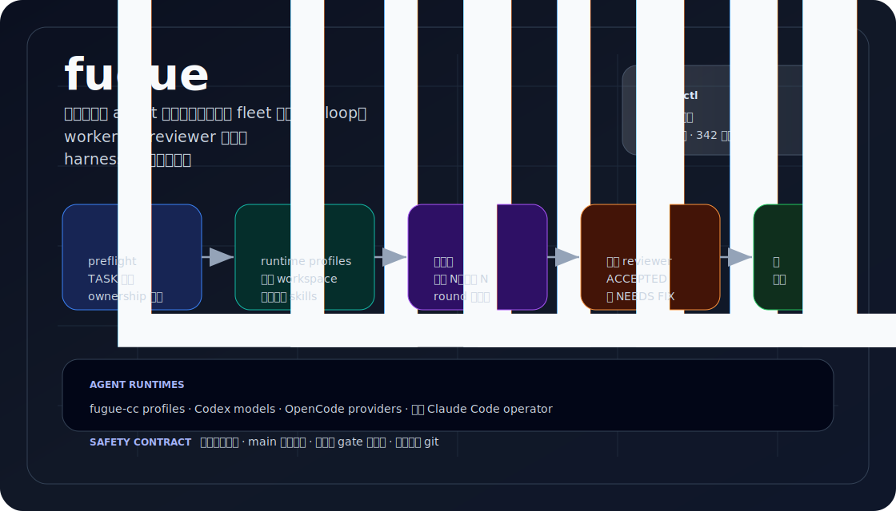
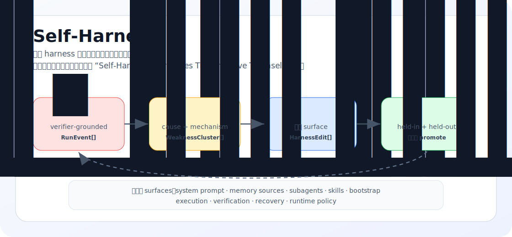

<div align="center">

[](README.md) &nbsp; [](README.zh-CN.md)

# FuguNano

### Sakana Fugu 的开放轻量重实现。

<p align="center">
  = 18.18" />
  
  
  
  <a href="https://github.com/BicaMindLabs/FuguNano/actions/workflows/ci.yml"></a>
  
</p>

<p align="center">
  <a href="#快速开始">快速开始</a> ·
  <a href="docs/AGENT_RUNTIME.md">Agent Runtime</a> ·
  <a href="docs/WORKFLOW.md">工作流</a> ·
  <a href="docs/SELF_HARNESS.md">Self-Harness</a> ·
  <a href="docs/PARITY.md">Engine 迁移</a> ·
  <a href="NOTICE">归属说明</a>
</p>

<p align="center">
  
</p>

</div>

> FuguNano 是 repo-native 的多 agent 编码 loop：由 9+ LLMs 驱动，
> 通过 Claude Code 隔离运行，并由独立 Codex reviewer 审查。
> 它轻量、有界、可自改进（Self-Harness），不需要训练 coordinator。
> 它不绑定某一类模型或某一个地区的供应商：今天接入你能稳定使用、信任的模型，
> 明天社区可以继续补新的 runtime，而工程闭环保持不变。

## 亮点

- **一个操作面** - `fuguectl` 驱动 preflight、dispatch、cache、integration、review、loop state、routing、skills 和 runtime maintenance。
- **Agent runtime 中立** - 逻辑 agent profile 可以把任务路由到 Claude Code provider instance、Codex model、OpenCode provider，或未来新增的 harness，而 loop 不变。
- **可扩展模型池** - 现有 profile 只是起点。社区可以继续接入可用的商业、开源、私有、本地或自托管模型，而不改变 FuguNano 的核心协议。
- **真实隔离** - worker 在独立 worktree 中编辑，配合 scoped workspace、按需 skills 和 ownership enforcement。
- **审查保持独立** - implementer 写代码，Codex 或另一个配置好的独立 reviewer 给出 `ACCEPTED` / `NEEDS FIX`。
- **输出不会丢** - 每个派发任务都先落 cache；join barrier 强制“派出 N 个，收回 N 个”。
- **修复有边界** - keep-best、二次确认、询问用户、升级和非收敛状态避免无限循环。
- **免训练学习** - allocation 用 benchmark prior 加 live review outcome 迭代路由。
- **Self-Harness 就绪** - TypeScript engine 能挖失败 run、提出有界 harness edits，并只 promote 不回退的改动。

## 快速开始

要求：macOS 或 Linux、Node.js >= 18.18、`git`、`tmux`，以及你选择使用的模型/API 凭证。推荐用 Codex 做 review。

```bash
git clone https://github.com/BicaMindLabs/FuguNano fugunano
cd fugunano

/path/to/fugunano/orchestration/fuguectl/fuguectl help quickstart
/path/to/fugunano/orchestration/fuguectl/fuguectl init --dry-run
make doctor       # 检查本机 CLI 和 provider readiness
make install      # 安装模型启动器
make verify       # 验证 launcher wiring
make ci-clean     # 从干净 engine install 跑完整本地 gate
```

真实 key 不进仓：

```bash
mkdir -p ~/.config
$EDITOR ~/.config/cc-model-secrets.env
```

先选择你要使用的 runtime。TypeScript engine 现在把 agent 建模成 profile：逻辑 id、harness（`fugue-cc` / `codex` / `opencode`）、可选的 harness-native target，以及供 policy 判断的 model family。详见 [docs/AGENT_RUNTIME.md](docs/AGENT_RUNTIME.md)。

可选的 `fugue-cc` worktree fleet 需要把 provider config 放到实际要编辑的项目里：

```bash
cp orchestration/fugue-cc/provider.config.example /path/to/project/.fugue-cc/provider.config
cd /path/to/project
fugue-cc
```

然后在另一个 shell 中运行 operator：

```bash
/path/to/fugunano/orchestration/fuguectl/fuguectl preflight --harness fugue-cc
/path/to/fugunano/orchestration/fuguectl/fuguectl fleet status
```

## Operator Skill

```bash
make install-skill
```

这会把 `/fugunano` 安装到 `~/.claude/skills/fugunano`，作为 Claude Code 的便捷 operator 入口。但 workflow 本身不绑定 Claude Code：Codex、OpenCode 和其他 agent 也可以读取 [AGENTS.md](AGENTS.md)，并通过同一套 agent profiles 派发。安装后可冒烟测试：

```bash
~/.claude/skills/fugunano/fuguectl selftest
```

## Loop 如何工作

```bash
fuguectl preflight --harness codex        # 轻量 reviewer 路径
fuguectl preflight --harness fugue-cc     # 完整 worktree fleet 路径
fuguectl task new "implement feature"
fuguectl dispatch cc-deepseek --template impl --task TASK.md --task-type backend
fuguectl cache barrier <round>
fuguectl integrate --work /path/to/project --agents "cc-deepseek cc-kimi"
fuguectl loop record --verdict NEEDS_FIX --round 1
fuguectl loop decide
```

| 阶段      | FuguNano 做什么                                                               |
| --------- | ----------------------------------------------------------------------------- |
| Plan      | 运行 preflight，创建 TASK 文件，划分 ownership，选择 worker。                 |
| Dispatch  | 通过 `fuguectl dispatch` 发送 scoped prompts。                                |
| Gather    | 缓存每个终态结果，并等待 join barrier。                                       |
| Integrate | 把通过审查的 worktree cherry-pick 到 `main`；隔离冲突和 ownership violation。 |
| Review    | 请求独立 reviewer 给出 `ACCEPTED` / `NEEDS FIX` verdict。                     |
| Repair    | 用有界 loop 状态机直到 accepted 或 escalated。                                |

完整流程见 [docs/WORKFLOW.md](docs/WORKFLOW.md)。

## Fugu、OpenFugu 与 FuguNano

Fugu、OpenFugu 和 FuguNano 在同一条路线上：当单一前沿模型或硬件路径变贵、
变窄、难治理时，系统能力开始来自“协调层”。区别在于这个协调层放在哪里。

<p align="center">
  
</p>

| 系统        | 协调层放在哪里             | 打开的能力                                          | 使用形态                                        |
| ----------- | -------------------------- | --------------------------------------------------- | ----------------------------------------------- |
| Sakana Fugu | API 背后的训练式 conductor | 不绑定单一模型的类前沿多模型合成能力                | 托管 / 闭源服务；conductor 训练与访问在仓库外   |
| OpenFugu    | 开放训练与服务栈           | 重建 Fugu 式 conductor 训练与 OpenAI 兼容服务的路径 | 适合想训练、检查、服务 conductor 路线的团队     |
| FuguNano    | 仓库原生工程闭环           | 免训练的多 agent 编码、独立审查与 Self-Harness      | 可 clone、可审计，先跑起来再决定是否训练 router |

FuguNano 不是要替代 Fugu / OpenFugu，而是把同一方向落到更轻的开放入口上：
先用策略、端口、审查门和 harness 自改进打开协作，再判断是否值得训练一个 conductor。

## 命令面

`orchestration/fuguectl/fuguectl` 是生产操作入口。当前有 20 个子命令和 21 套测试。

| 区域                   | 命令                                                                                                                                                                                                  |
| ---------------------- | ----------------------------------------------------------------------------------------------------------------------------------------------------------------------------------------------------- |
| Setup and recon        | `fuguectl doctor`、`fuguectl init --dry-run\|--write`、`fuguectl preflight --harness fugue-cc\|codex\|opencode\|all`、`fuguectl fleet status\|up\|down`                                               |
| Planning               | `fuguectl task new\|log\|done`、`fuguectl template <name>`、`fuguectl plan "<goal>" [--harness h]`、`fuguectl goal template\|show\|check`                                                             |
| Routing and context    | `fuguectl allocate <type>`、`fuguectl workspace list\|show\|model\|context`、`fuguectl agents template\|validate\|list\|resolve`、`fuguectl skills index\|list\|match\|show\|inject\|validate\|forge` |
| Dispatch and gather    | `fuguectl dispatch <target>`、`fuguectl cache init\|put\|fail\|barrier\|collect\|resume`                                                                                                              |
| Integration and loop   | `fuguectl integrate --work <repo>`、`fuguectl loop init\|record\|decide\|status`、`fuguectl run set\|round\|status\|next\|clear`、`fuguectl summary <round>`                                          |
| Memory and maintenance | `fuguectl experience add\|list\|recall\|show`、`fuguectl runtime check\|adapt`、`fuguectl selftest`                                                                                                   |

## TypeScript Engine

`engine/` 是 typed 实现：严格 TypeScript、ports-and-adapters 分层、纯 domain policy，以及真实 harness / storage adapters。`AgentRegistry` 是从 script-first 编排走向 engine-native 编排的一步：coordinator 能在同一轮里把逻辑 agent id 解析到 `fugue-cc`、Codex 和 OpenCode runtime profile。

```bash
cd engine
npm run check
npm run build
node dist/cli/main.js version
```

当前 engine CLI 暴露：

```bash
fugue version
fugue doctor
fugue init [--dry-run|--write]
fugue fleet status|up|down
fugue allocate <task-type>|list|record|feed|stats|reset|decay
fugue dispatch <target> --harness fugue-cc|codex|opencode [--timeout-ms n] [--harness-arg x] --template <name>|--prompt-file <file>|--prompt <text>
fugue integrate --work <repo> --agents "a b" [--ownership file] [--dry]
fugue skills index|list|match|show|inject|validate|forge
fugue preflight [--harness fugue-cc|codex|opencode|all] [--config-only] [provider.config]
fugue cache init|put|fail|status|barrier|collect|list|resume --cache <dir>
fugue plan "<goal>" --harness fugue-cc|codex|opencode --out <dir> [--models m1,m2]
fugue task new|log|done
fugue template <name> --dir <templates> [--set KEY=VALUE ...]
fugue workspace list|show|model|context
fugue experience add|list|recall|show --store <dir>
fugue summary <round> --cache <dir> [--task <file>]
fugue runtime check|adapt --state <dir>
fugue run set|round|status|next|clear
fugue loop init|record|decide|next|status
fugue goal template|show|check
fugue agent-registry template|validate|list|resolve
fugue self-harness template|run
```

## Self-Harness

Self-Harness 改进的是 harness 配置，不是底层模型。FuguNano 的实现是对上海人工智能实验室论文 [Self-Harness: Harnesses That Improve Themselves](https://arxiv.org/abs/2606.09498) 的 engine-native 抽象。

<p align="center">
  
</p>

```bash
cd engine
npm run build
node dist/cli/main.js self-harness template > /tmp/self-harness.json
node dist/cli/main.js self-harness run \
  --spec /tmp/self-harness.json \
  --state ~/.config/fugunano \
  --cwd /path/to/workspace
```

严格 JSON spec、editable surfaces、验证规则和 smoke tests 见 [docs/SELF_HARNESS.md](docs/SELF_HARNESS.md)。

## 仓库地图

| 路径                           | 内容                                                                               |
| ------------------------------ | ---------------------------------------------------------------------------------- |
| `backends/bin/`                | 模型启动器、registry、`cc-models` 和 `cc-sync`。                                   |
| `backends/{install,verify}.ts` | 本地安装和 launcher 验证。                                                         |
| `orchestration/fuguectl/`      | Node `fuguectl` wrappers、templates、workspaces、skill bundle 和测试。             |
| `orchestration/fugue-cc/`      | runtime bridge 使用的脱敏 provider 配置模板。                                      |
| `orchestration/cn-plugin/`     | Claude Code `/cn:*` 插件和 dispatch agent。                                        |
| `orchestration/agent-team/`    | 更高层多模型规划示例。                                                             |
| `engine/`                      | TypeScript package、domain ports、adapters、CLI 和 Self-Harness loop。             |
| `scripts/`                     | 密钥扫描、launcher lint、docs drift check 和 skill installer。                     |
| `docs/`                        | Agent runtime、workflow、architecture、parity、integrations 和 Self-Harness 指南。 |
| `AGENTS.md`                    | Claude Code、Codex、OpenCode 都可读取的跨 harness 操作入口。                       |

## 安全模型

- 真实 key 只放在 `~/.config/cc-model-secrets.env` 或已 ignore 的本地配置。
- `.fugue-cc/` 不进 git。
- review 路径走 Codex 或另一个独立 reviewer。Antigravity（`agy`）可作为 implementer runtime；旧 `gemini` CLI 已退役。
- join barrier 没收齐所有终态结果前，不进入下一轮。
- 先让确定性 gate 失败，再消耗 reviewer tokens。
- push 前跑 `npm run ci`。

## 开发

```bash
make ci          # scan + launcher lint + docs + plugin/fuguectl + engine checks
make ci-clean    # 同上，但先干净安装 engine dependencies
make scan        # 密钥泄漏 gate
make lint        # Node launcher syntax check
make check-docs  # README + Self-Harness docs drift gate
make test        # cn-plugin + fuguectl selftest
make test-engine # TypeScript engine typecheck + lint + vitest
make doctor      # 本机环境侦察
make help        # 列出所有 make targets
```

根目录 npm scripts 镜像同一批 gates：

```bash
npm run ci
npm run ci:clean
npm run lint:launchers
npm run test:fuguectl
npm run test:engine
```

## 安全报告

见 [SECURITY.md](SECURITY.md)。仓库只放脱敏 examples，CI 会扫泄漏，漏洞请通过 GitHub Security Advisory 私下报告。

## 致谢

- [Sakana AI Fugu](https://sakana.ai/fugu/) 给出了多模型编排框架。
- [trotsky1997/OpenFugu](https://github.com/trotsky1997/OpenFugu) 是互补的训练式重建。
- [openai/codex-plugin-cc](https://github.com/openai/codex-plugin-cc) 提供了 `/cn:*` 层派生的 plugin 架构。
- [Zleap-AI/Zleap-Agent](https://github.com/Zleap-AI/Zleap-Agent) 启发了 workspace isolation 和 experience memory。
- [SeemSeam/claude_codex_bridge](https://github.com/SeemSeam/claude_codex_bridge) 作为 provider-runtime bridge 的参考。
- 上海人工智能实验室的 [Self-Harness 论文](https://arxiv.org/abs/2606.09498) 启发了 `fugue self-harness` 的 harness-improvement loop。
- [kunchenguid/no-mistakes](https://github.com/kunchenguid/no-mistakes) 与 [lavish-axi](https://github.com/kunchenguid/lavish-axi) 启发了 loop-state 和 docs-drift 思路。
- [merkyor/Lynn](https://gitee.com/merkyor/Lynn) 启发了编排器侧 ownership enforcement。
- Anthropic 官方 `skill-creator` meta-skill 支撑了 skill authoring 和 validation flow。

归属细节见 [NOTICE](NOTICE)。

## 许可

[Apache-2.0](LICENSE) © 2026 BicaMind Labs.
