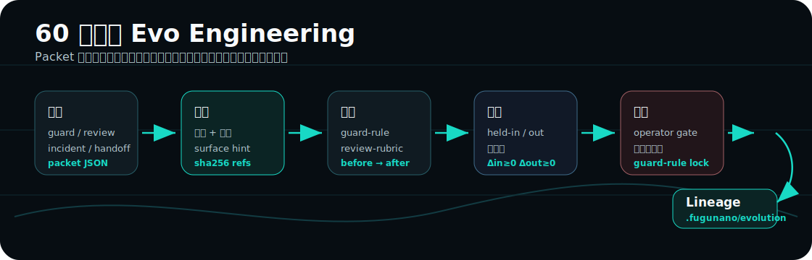
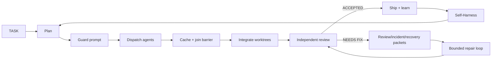

<div align="center">

[](README.md) &nbsp; [](README.zh-CN.md)

# FuguNano

### Sakana Fugu 的开放轻量重实现

### 面向多 agent 软件工程的证据门控 Evo Engineering

<p align="center">
  = 18.18" />
  
  
  
  <a href="https://github.com/BicaMindLabs/FuguNano/actions/workflows/ci.yml"></a>
  
</p>

<p align="center">
  <a href="#快速开始">快速开始</a> |
  <a href="#工作流">工作流</a> |
  <a href="#命令面">命令面</a> |
  <a href="docs/WORKFLOW.md">完整流程</a> |
  <a href="docs/SELF_HARNESS.md">Self-Harness</a> |
  <a href="docs/PARITY.md">参考与对齐</a>
</p>


</div>

> FuguNano 是 repo-native 的多 agent 编码 loop：由 9+ LLMs 驱动，通过
> Claude Code 隔离运行，并由独立 Codex reviewer 审查。它轻量、有界、可自改进
> （Self-Harness），不需要训练 coordinator。

FuguNano 不是一个新模型，也不是托管服务。它是一个工程控制面，把已有 agent 组织成可审计闭环：
规划、派发、汇合、审查、修复、学习，并让 harness 自己继续改进。

## 为什么需要 FuguNano

| 问题                               | FuguNano 的回答                                       |
| ---------------------------------- | ----------------------------------------------------- |
| 前沿模型或硬件路径越来越难稳定依赖 | 协调多个可用模型，而不是押注单一路线。                |
| 多 agent 输出容易丢                | dispatch 可落盘；每轮都有 join barrier。              |
| Review 变成长段自然语言            | review / incident / recovery / guard 都有 packet。    |
| Agent loop 容易空转                | 修复 loop 有边界、有状态，并由独立 reviewer 审查。    |
| Prompt/runtime 风险不可见          | guard packet 和 action certificate 留下本地证据。     |
| 一次经验用完就消失                 | experience memory 和 Self-Harness 会把经验喂回 loop。 |

## 60 秒看懂 Evo Engineering



FuguNano 把运行时证据当成工程闭环的入口，而不是报告的终点。Packet 会变成弱点信号；
候选修改会在固定 held-in/held-out cases 上评分；通过非回退门的修改会写入可审计
lineage。`guard-rule` 这样的安全面仍然只能由 operator 晋升。

Dogfood fixture：[.fugunano/evolution/evo-guard-rule-tighten-gh-release-certificate.json](.fugunano/evolution/evo-guard-rule-tighten-gh-release-certificate.json)
记录了一次真实的 guard-rule 晋升，用来补上缺失 action-certificate 检查的路径。

## 快速开始

要求：macOS 或 Linux、Node.js >= 18.18、`git`、`tmux`，以及你选择使用的模型凭证。
推荐用 Codex 做独立 review。

```bash
git clone https://github.com/BicaMindLabs/FuguNano fugunano
cd fugunano

/path/to/fugunano/orchestration/fuguectl/fuguectl help quickstart
/path/to/fugunano/orchestration/fuguectl/fuguectl init --dry-run
make doctor
make install
make verify
make ci-clean
```

真实 key 不进仓：

```bash
mkdir -p ~/.config
$EDITOR ~/.config/cc-model-secrets.env
```

可选的 `fugue-cc` worktree fleet：

```bash
cp orchestration/fugue-cc/provider.config.example /path/to/project/.fugue-cc/provider.config
cd /path/to/project
fugue-cc

/path/to/fugunano/orchestration/fuguectl/fuguectl preflight --harness fugue-cc
/path/to/fugunano/orchestration/fuguectl/fuguectl fleet status
```

安装 operator skill：

```bash
make install-skill
~/.claude/skills/fugunano/fuguectl selftest
```

这个 skill 对 Claude Code 很方便，但 workflow 不绑定 Claude Code。Codex、OpenCode、
Antigravity 和未来 agent 都可以走同一套 agent profiles。前端/UI 任务可以用
`agy --prompt "..."`，review 仍然应保持独立。

## 工作流



日常入口刻意保持很短：

```bash
fuguectl preflight --harness lite
fuguectl preflight --harness codex
fuguectl preflight --harness opencode --target opencode/deepseek-v4-flash-free
fuguectl preflight --harness agy
fuguectl preflight --harness fugue-cc

fuguectl task new "implement feature"
fuguectl plan "implement feature" --harness lite --models a,b --out /tmp/fugunano-plan --timeout-ms 120000 --allow-partial --codex-clean --harness-arg x --codex-arg x --opencode-arg x --agy-arg x --task TASK.md
fuguectl guard prompt /tmp/prompt.md --source-ref TASK.md
fuguectl dispatch cc-deepseek --template impl --task TASK.md --task-type backend
fuguectl cache barrier 1
fuguectl integrate --work /path/to/project --agents "cc-deepseek cc-kimi"
fuguectl review packet /tmp/review.txt --json
fuguectl incident packet /tmp/failure.log --json
fuguectl incident recovery /tmp/failure.log --json
fuguectl loop record --verdict NEEDS_FIX --round 1
fuguectl loop decide
```

`fuguectl smoke --harness all --codex-clean --timeout-ms 120000 --task TASK.md
--out-dir /tmp/fugunano-smoke` 会写入带
`status`/`passed`/`failed`/`exitCode` 的 `summary.json`。

`fuguectl plan ...` 会写入 `<out>/summary.json`，字段为
`status`/`exitCode`/`allowPartial`/`succeeded`/`available`/`failed`，不用翻模型聊天记录也能检查规划结果。

Harness 列表：`fugue-cc|codex|opencode|agy`。

## Fugu、OpenFugu、FuguNano

<p align="center">
  
</p>

| 系统        | 协调层放在哪里             | 最适合什么                                  |
| ----------- | -------------------------- | ------------------------------------------- |
| Sakana Fugu | API 背后的训练式 conductor | 托管式多模型合成。                          |
| OpenFugu    | 开放训练与服务栈           | 重建和研究 conductor 路线。                 |
| FuguNano    | 仓库原生工程闭环           | 免训练的编排、审查、修复和 harness 自改进。 |

FuguNano 是这条路线上的轻量开放入口：先用策略、端口、审查门、证据包和 harness 自改进把协作跑起来，
再判断是否值得训练一个 conductor。

## 命令面

`orchestration/fuguectl/fuguectl` 是生产入口：28 个子命令、29 套测试、408 个 wrapper 断言。

| 区域          | 命令                                                                                                                                                                                                                                                                                                                         |
| ------------- | ---------------------------------------------------------------------------------------------------------------------------------------------------------------------------------------------------------------------------------------------------------------------------------------------------------------------------- |
| Setup         | `fuguectl doctor`、`fuguectl init --dry-run\|--write`、`fuguectl version`、`fuguectl preflight --harness fugue-cc\|codex\|opencode\|agy\|lite\|all`、`fuguectl smoke`、`fuguectl fleet status\|up\|down`                                                                                                                     |
| Planning      | `fuguectl task new\|log\|done\|handoff\|digest`、`fuguectl template <name>`、`fuguectl plan "<goal>" [--harness h\|lite] [--models a,b] [--out dir] [--timeout-ms n] [--allow-partial] [--codex-clean] [--harness-arg x] [--codex-arg x] [--opencode-arg x] [--agy-arg x] [--task f]`、`fuguectl goal template\|show\|check` |
| Routing       | `fuguectl allocate <type>`、`fuguectl workspace list\|show\|model\|context`、`fuguectl agents template\|validate\|list\|resolve`、`fuguectl skills index\|list\|match\|show\|inject\|validate\|forge`                                                                                                                        |
| Dispatch      | `fuguectl guard prompt <file\|->`、`fuguectl dispatch <target> [--certificate <file>]`、`fuguectl cache init\|put\|fail\|barrier\|collect\|resume`                                                                                                                                                                           |
| Review/Repair | `fuguectl integrate --work <repo>`、`fuguectl review packet <file\|->`、`fuguectl incident packet\|recovery <file\|->`、`fuguectl loop init\|record\|decide\|status`、`fuguectl run set\|round\|status\|next\|clear`、`fuguectl summary <round>`                                                                             |
| Memory/Evolve | `fuguectl experience add\|audit\|eval\|learn\|list\|policy\|promote\|recall\|show`、`fuguectl evolve mine\|validate\|promote\|history`、`fuguectl self-harness template\|run`、`fuguectl runtime check\|adapt`、`fuguectl selftest`                                                                                          |

## 证据包

| Packet                   | 命令                              | 用途                                                |
| ------------------------ | --------------------------------- | --------------------------------------------------- |
| Task handoff             | `fuguectl task handoff`           | 把任务契约和近期证据交给下一个 agent。              |
| Task digest              | `fuguectl task digest`            | 把长 TASK 压成有界 prompt card。                    |
| Review packet            | `fuguectl review packet`          | 把 review 文本转成 finding 和 check。               |
| Incident packet          | `fuguectl incident packet`        | 给失败 trace 标原因、层级和证据。                   |
| Incident recovery packet | `fuguectl incident recovery`      | 输出 containment / repair / validation / learning。 |
| Runtime guard packet     | `fuguectl guard prompt`           | dispatch 前拦截高风险 prompt。                      |
| Action certificate       | `fuguectl dispatch --certificate` | 给 runtime action 留证明侧车。                      |

这些 packet 都是确定性 TypeScript，不是模型总结。

## Self-Harness

<p align="center">
  
</p>

Self-Harness 会挖 verifier-grounded failure，提出有边界的 harness surface edit，并只 promote 不回退的改动。
操作说明见 [docs/SELF_HARNESS.md](docs/SELF_HARNESS.md)。

## 文档地图

| 你想看什么               | 文件                                           |
| ------------------------ | ---------------------------------------------- |
| Agent profile 与 runtime | [docs/AGENT_RUNTIME.md](docs/AGENT_RUNTIME.md) |
| 完整 workflow            | [docs/WORKFLOW.md](docs/WORKFLOW.md)           |
| 架构和 ports/adapters    | [docs/ARCHITECTURE.md](docs/ARCHITECTURE.md)   |
| Self-Harness             | [docs/SELF_HARNESS.md](docs/SELF_HARNESS.md)   |
| 对齐关系和参考来源       | [docs/PARITY.md](docs/PARITY.md)               |
| 集成说明                 | [docs/INTEGRATIONS.md](docs/INTEGRATIONS.md)   |
| Agent 协作约定           | [AGENTS.md](AGENTS.md)                         |

## 开发

```bash
npm run scan
npm run lint:launchers
npm run check:docs
npm run test:fuguectl
cd engine && npm run check && npm run build
npm run ci
```

engine 是 strict TypeScript + ports/adapters。Shell 尽量只做薄启动器；新的稳定能力应该进 `engine/`。

## 致谢

FuguNano 借鉴了 Sakana AI Fugu、OpenFugu、上海 AI Lab Self-Harness、
Codex/Claude/OpenCode runtime tooling，以及 agent review、provenance、incident response、
memory 和 prompt safety 方向的研究。完整参考见 [NOTICE](NOTICE) 和 [docs/PARITY.md](docs/PARITY.md)。

## 安全

不要提交真实 key。本地 secret 放到 `~/.config/cc-model-secrets.env`。安全问题请私下报告。

## 许可

Apache-2.0。见 [LICENSE](LICENSE)。
