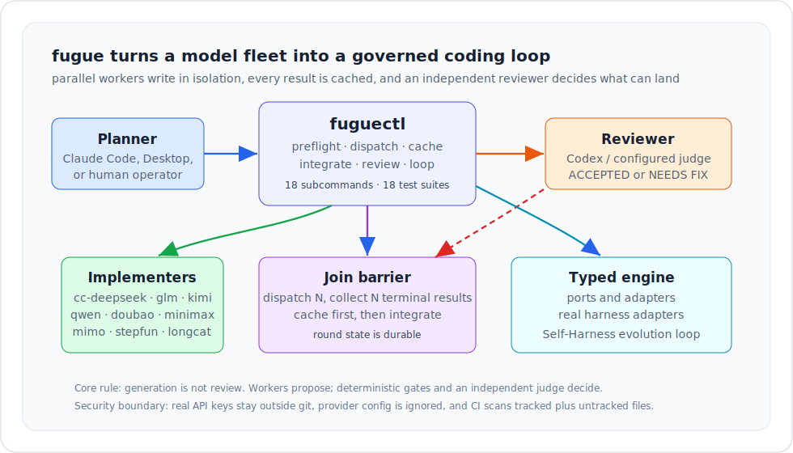
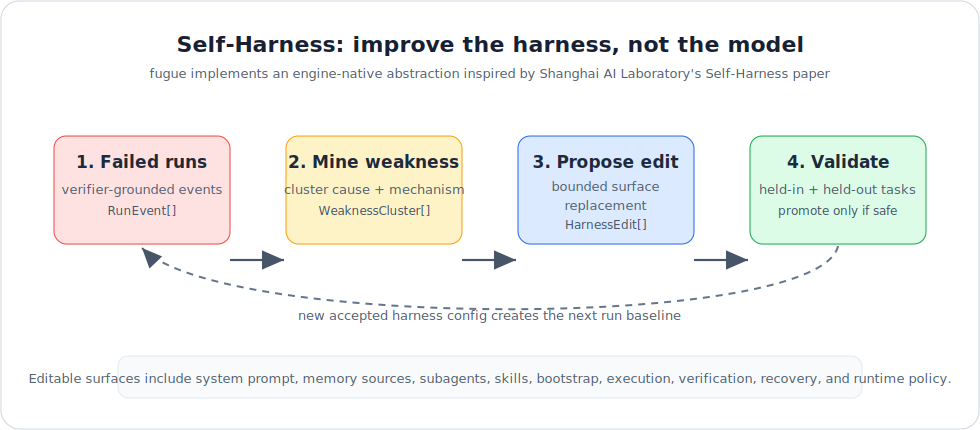

# fugue

[](https://github.com/BicaMindLabs/open-sakanafugu/actions/workflows/ci.yml)
[](LICENSE)
[](package.json)
[](orchestration/fuguectl)

**[English](README.md) | 简体中文**

**fugue** 是一个免训练、可自托管的多 agent 编码 harness。它把一组 AI worker 放进同一个可治理 loop：实现、审查、整合、自我改进都分开跑，所以系统能被检查、能被测试，也能在错的时候停下来。

日常操作面是 `fuguectl`。Claude Code skill 是 `/fugue`。

<p align="center">
  
</p>

## 为什么需要 Fugue

单 agent 编码适合窄任务；一旦任务需要并行实现、独立审查或可复现的修复路径，就需要工程化编排。fugue 把这些问题显式化：

- **多个 worker，一个控制面** - 专长不同的 Claude Code clones 都通过 `fuguectl` 调度。
- **生成不是审查** - implementer 负责写，Codex 或配置好的独立 reviewer 负责 verdict。
- **先缓存再相信** - 一轮派出 N 个任务，就必须收回 N 个终态结果才能整合。
- **有界修复** - review-fix loop 有 keep-best、二次确认、询问用户、升级和非收敛状态。
- **刻意缩小 context** - workspace 和 skill injection 只给 worker 看必要信息。
- **免训练学习** - allocation 用 benchmark prior 加 live review outcome 更新路由。
- **Harness 自改进** - typed engine 能从失败 run 里挖弱点，并测试有界 harness 改动。

## 你会得到什么

| 层 | 状态 | 用途 |
| --- | --- | --- |
| `orchestration/fuguectl/` | 生产可用 shell 操作层：`fuguectl`、18 个子命令、18 套测试、322 个断言 | 日常多 agent 编码 |
| `engine/` | 严格 TypeScript ports-and-adapters engine | 类型化集成、`fugue` CLI、Self-Harness |
| `orchestration/fugue-cc/` | 脱敏 provider runtime 模板 | 通过模型 provider 运行 Claude Code clones |
| `orchestration/cn-plugin/` | Claude Code `/cn:*` 插件 | 轻量单机模型调度 |

shell 操作层保持全绿，能力逐步迁移到 typed engine。迁移状态见 [docs/PARITY.md](docs/PARITY.md)。

## 快速开始

要求：macOS 或 Linux、Node.js >= 18.18、`git`、`tmux`，以及你选择配置的模型/API 凭证。推荐用 Codex 做 review。

```bash
git clone https://github.com/BicaMindLabs/open-sakanafugu fugue
cd fugue

make doctor       # 检查本机 CLI 和 provider readiness
make install      # 安装模型启动器
make verify       # 验证 launcher wiring
make ci-clean     # 从干净 engine install 跑完整本地 gate
```

真实 key 不进仓：

```bash
mkdir -p ~/.config
$EDITOR ~/.config/cc-model-secrets.env
```

完整 `fugue-cc` fleet 需要把脱敏 provider config 放到实际要编辑的项目里：

```bash
cp orchestration/fugue-cc/provider.config.example /path/to/project/.fugue-cc/provider.config
cd /path/to/project
fugue-cc
```

然后在另一个 shell 里运行 operator：

```bash
/path/to/fugue/orchestration/fuguectl/fuguectl preflight
/path/to/fugue/orchestration/fuguectl/fuguectl fleet status
```

## 安装 Claude Code Skill

```bash
make install-skill
```

这会安装到 `~/.claude/skills/fugue`。重启 Claude Code 后，用 `/fugue` 唤醒，或直接描述一个多 agent 编码任务。安装后可这样冒烟测试：

```bash
~/.claude/skills/fugue/fuguectl selftest
```

## Operator Loop

1. **Plan** - preflight，打开 TASK 文件，划分 ownership，选择 worker。
2. **Dispatch** - 通过 `fuguectl dispatch` 发送 scoped prompt。
3. **Gather** - 缓存每个结果，并等待 join barrier。
4. **Integrate** - 把通过审查的 worktree cherry-pick 到 `main`；隔离冲突和 ownership violation。
5. **Review** - 得到独立 ACCEPTED / NEEDS FIX verdict。
6. **Fix or finish** - 用有界 loop 状态机直到 accepted 或 escalated。

```bash
fuguectl preflight
fuguectl task new "implement feature"
fuguectl dispatch cc-deepseek --template impl --task TASK.md --task-type backend
fuguectl cache barrier <round>
fuguectl integrate --work /path/to/project --agents "cc-deepseek cc-kimi"
fuguectl loop record --verdict NEEDS_FIX --round 1
fuguectl loop decide
```

完整流程见 [docs/WORKFLOW.md](docs/WORKFLOW.md)。

## 命令地图

`orchestration/fuguectl/fuguectl` 是主操作入口。精确语法看 `fuguectl help`。

| 区域 | 命令 |
| --- | --- |
| Setup and recon | `fuguectl doctor`、`fuguectl preflight`、`fuguectl fleet status\|up\|down` |
| Planning | `fuguectl task new\|log\|done`、`fuguectl template <name>`、`fuguectl plan "<goal>"`、`fuguectl goal template\|show\|check` |
| Routing and context | `fuguectl allocate <type>`、`fuguectl workspace list\|show\|model\|context`、`fuguectl skills index\|list\|match\|show\|inject\|validate\|forge` |
| Dispatch and gather | `fuguectl dispatch <target>`、`fuguectl cache init\|put\|fail\|barrier\|collect\|resume` |
| Integration and loop | `fuguectl integrate --work <repo>`、`fuguectl loop init\|record\|decide\|status`、`fuguectl run set\|round\|status\|next\|clear`、`fuguectl summary <round>` |
| Memory and maintenance | `fuguectl experience add\|list\|recall\|show`、`fuguectl runtime check\|adapt`、`fuguectl selftest` |

当前 operator 有 18 个子命令和 18 套测试。

## TypeScript Engine

`engine/` 包是 fugue 编排模型的 typed 实现：严格 TypeScript、ports-and-adapters 分层、纯 domain policy，以及真实 harness / store adapters。

```bash
cd engine
npm run check
npm run build
node dist/cli/main.js version
```

目前 engine CLI 暴露：

```bash
fugue version
fugue doctor
fugue task new|log|done
fugue goal check <spec>
fugue self-harness template|run
```

## Self-Harness

Self-Harness 改进的是 harness 配置，不是底层模型。fugue 的实现是对上海人工智能实验室论文 [Self-Harness: Harnesses That Improve Themselves](https://arxiv.org/abs/2606.09498) 的 engine-native 抽象。

<p align="center">
  
</p>

```bash
cd engine
npm run build
node dist/cli/main.js self-harness template > /tmp/self-harness.json
node dist/cli/main.js self-harness run \
  --spec /tmp/self-harness.json \
  --state ~/.config/fugue \
  --cwd /path/to/workspace
```

严格 JSON spec、editable surfaces、验证规则和 smoke tests 见 [docs/SELF_HARNESS.md](docs/SELF_HARNESS.md)。

## 仓库导览

| 路径 | 内容 |
| --- | --- |
| `backends/bin/` | 模型启动器、registry、`cc-models` 和 `cc-sync`。 |
| `backends/{install,verify}.sh` | 本地安装和 launcher 验证。 |
| `orchestration/fuguectl/` | `fuguectl`、共享 shell libraries、templates、workspaces、skill bundle 和测试。 |
| `orchestration/fugue-cc/` | runtime bridge 使用的脱敏 provider 配置模板。 |
| `orchestration/cn-plugin/` | Claude Code `/cn:*` 插件和 dispatch agent。 |
| `orchestration/agent-team/` | 更高层多模型规划示例。 |
| `engine/` | TypeScript package、domain ports、adapters、CLI 和 Self-Harness loop。 |
| `scripts/` | 密钥扫描、shell lint、docs drift check 和 skill installer。 |
| `docs/` | Workflow、architecture、parity、integrations 和 Self-Harness 指南。 |
| `AGENTS.md` | Claude Code、Codex、OpenCode 都可读取的跨 harness 操作入口。 |

## 安全模型

- 真实 key 只放在 `~/.config/cc-model-secrets.env` 或已 ignore 的本地配置。
- `.fugue-cc/` 不进 git。
- review 路径走 Codex 或另一个独立的非 Gemini reviewer。
- join barrier 没收齐所有终态结果前，不进入下一轮。
- 先让确定性 gate 失败，再消耗 reviewer tokens。
- push 前跑 `npm run ci`。

## 开发

```bash
make ci          # scan + shell lint + docs + plugin/fuguectl + engine checks
make ci-clean    # 同上，但先干净安装 engine dependencies
make scan        # 密钥泄漏 gate
make lint        # bash -n + shellcheck
make check-docs  # README + Self-Harness docs drift gate
make test        # cn-plugin + fuguectl selftest
make test-engine # TypeScript engine typecheck + lint + vitest
make doctor      # 本机环境侦察
make help        # 列出所有 make targets
```

根目录 npm scripts 镜像同一批 gates：

```bash
npm run ci
npm run ci:clean
npm run test:fuguectl
npm run test:engine
```

## 安全报告

见 [SECURITY.md](SECURITY.md)。简短版：仓库只放脱敏 examples，CI 会扫泄漏，漏洞请通过 GitHub Security Advisory 私下报告。

## 致谢

- [Sakana AI Fugu](https://sakana.ai/fugu/) 给出了多模型编排框架。
- [trotsky1997/OpenFugu](https://github.com/trotsky1997/OpenFugu) 是互补的训练式重建。
- [openai/codex-plugin-cc](https://github.com/openai/codex-plugin-cc) 提供了 `/cn:*` 层派生的 plugin 架构。
- [Zleap-AI/Zleap-Agent](https://github.com/Zleap-AI/Zleap-Agent) 启发了 workspace isolation 和 experience memory。
- [SeemSeam/claude_codex_bridge](https://github.com/SeemSeam/claude_codex_bridge) 作为 provider-runtime bridge 的参考。
- 上海人工智能实验室的 [Self-Harness 论文](https://arxiv.org/abs/2606.09498) 启发了 `fugue self-harness` 的 harness-improvement loop。
- [kunchenguid/no-mistakes](https://github.com/kunchenguid/no-mistakes) 与 [lavish-axi](https://github.com/kunchenguid/lavish-axi) 启发了 loop-state 和 docs-drift 思路。
- [merkyor/Lynn](https://gitee.com/merkyor/Lynn) 启发了编排器侧 ownership enforcement。
- Anthropic 官方 `skill-creator` meta-skill 支撑了 skill authoring 和 validation flow。

归属细节见 [NOTICE](NOTICE)。

## 许可

[Apache-2.0](LICENSE) © 2026 BicaMind Labs.
